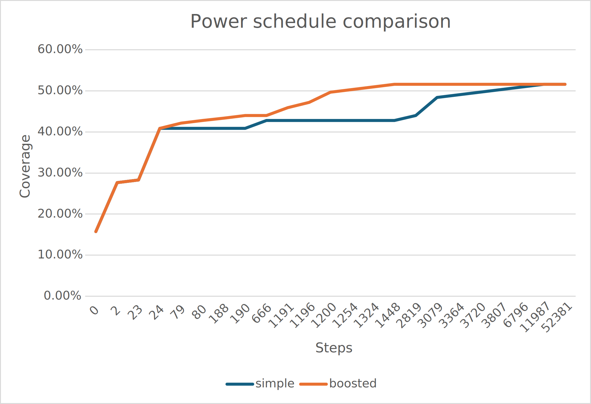

# Greybox fuzzing - NI-APT task 3


### Bonuses that are implemented:

More mutators:
- Insert digit - inserts a digit somewhere in the string
- Insert newline - inserts newline characters somewhere in the string
- Concatenate - Joins two mutations together
- Change number - If the mutant is a number, add something to it
- ASCII versions of flip bit and add - keeps values in valid ASCII ranges

Handcrafted seeds
- Visible in the `seeds` folder
- Will be used if no seeds folder is provided

Hybrid fuzzing
- Sometimes the fuzzer chooses to generate a random string as input, instead of mutating an existing seed. If it suceeds, the fuzzer adds it as a new seed. This ensures that there is no regression from blackbox fuzzing.
- New argument "greyness" to influece the probability of the fuzzer to use random string

Statistics
- Reporting number of unique hashes currently in use

Cluster the number of hits per line
- Created own structure how to hash coverage, so that cycles do not influence the results. If a line is visited, it does not matter how many times now.

## Setup

After cloning, run:
`git submodule update --init --recursive`
This ensures that required libraries are available for the compilation process.

Also install packages: `make cmake g++ git libboost-all-dev libgtest-dev curl llvm-17 clang-17 mull-17`

Look in CI file to see how to, if problematic. Mull requires a setup, but you don't need it if you won't be mutating.

## Testing

### Coverage

Line coverage: 76%

### Mutation testing

Mutation score: 70%

Mutation testing heavily depends on randomness. Value is around 70% +- 15%.

## Experiment


Tested on uniq.

Boosted power schedule starts off faster (in amount of iterations), but simple schedule catches up and eventually reaches higher scores.

# Project annotation

The goal of this project is to create a greybox fuzzer: you will integrate the feedback from the coverage of the fuzzed program.
This task heavily builds on [task-2] and your tool should still support blackbox fuzzing (no regressions).

The core of the work of task 3 is to add mutation operators, integrate your coverage tool from [task-1], and support 2 power schedules:

- one inspired by the base AFL power schedule
- the exponential one of boosted greybox fuzzing

## Input generation

You should support mutation fuzzing.

Initial seeds will be provided by the user in a folder given as an argument, or if no input folder or no seeds inside, generated using the random generators of task 2.

As in AFL++, you _can_ add a `queue` folder (to the `results` folder) that will store seeds and will be populated with the initial seeds at the beginning and then will store the [_interesting_ inputs](#interesting-inputs). This adds presure on the hard drive so you might also want to keep the queue in memory.

### Mutating an input

Given an interesting input, choose several mutation operators and how many times you want to apply them to generate one candidate.

You should have at least the following mutation operators, on array of bytes:

- delete a random block: the starting index is random and the size of the block is random, with a distribution biased towards size 1
- insert a random block: same
- flip a bit randomly
- add/substract a random small integer to a random byte in the array (uniformly random, or better, biased towards 1)

Optionallly, support splicing:

- splicing: given 2 interesting inputs from the queue and a random index compatible with 2 inputs from the queue, generate 2 new candidates by concatenating the first part of input 1 with the 2nd part of input and the 1st part of input 2 with the second part of input 1.
- when: if you have already used all the seeds in the queue and they have not led to increased coverage
- selecting the interesting inputs: if using the AFL-inspired power schedule, pick 2 distinct seeds randomly; with the boosted, use the seed with the most energy and a distinct random one in the queue.

Feel free to add more mutation operators, for instance, inserting known interesting integers at random positions. You can also add a dictionarry-based mutation where you insert user-provided values at random positions.

### Power schedules

_Or how to choose the next candidate(s) for fuzzing._

For each seed $s$ in the queue, maintain its energy $e$, a hash $h$ of its coverage (for instance, if you output the lcov deterministically, you can hash the sorted set of `DA` lines), its execution time $T$, its size in bytes $s$, how many times it was already selected to be mutated $n_m$, and how many times $n_c$ it led to an increase in coverage.

You should support at least those power schedules:

- AFL-inspired power schedule: rank all seeds by a score $T \times s \times \frac{n_m}{n_c}$ where smaller is better, pick the best 10\% and assign to those _favourite_ seeds a global weight of 0.5. It means that for $n$ favourite seeds, its weight is $\frac{0.5}{n}$. The remaining interesting seeds have to share a weight of 0.5.
- exponential power schedule from boosted greybox fuzzing, with exponent $5$. The energy of a seed is $e = \frac{1}{f(p(s))^5}$, where $p(s)$ uniquely identifies a path (it is the hash of the coverage for seed $s$, that we use as an approximation of the path) and $f(p)$ is the number of times that path (i.e. that hash) was hit.

The next candidate is chosen by doing a weighted random choice, where the weights are the energies of the seeds.

### Minimization

The crashing inputs should still be minimized if indicated to.
You can also minimize interesting seeds in the queue and the initial seeds if you want to.

## Runner

### What does not change

The input to the fuzzed program should be provided in possible 2 ways:

- through the standard input (stdin)
- through command line arguments and input files. The minimum is to support one positional argument, the path of the file, and to create and randomly fill the file. The file can be text or binary.

The json specification for command line arguments is still optional.

### What changes

- Add feedback based on coverage: you have 3 options.
  - use your coverage tool to instrument the fuzzed program. Note that compared to AFL, your coverage tool outputs line coverage, not branch coverage.
  - use `gcov` or `llvm-cov`
  - modify your coverage tool to write the coverage to a shared memory area to be able to read it more quickly from the fuzzer
- Update the energy of the seed on which the fuzzed program was run

Add _interesting_ inputs to the queue.

<div class="admonition-block important"> <p> 
In task 2, you were performing blackbox fuzzing and so your fuzzer was directly given executable binaries to fuzz. In task 3, you do greybox fuzzing and so you have some knowledge of the source code, so as to be able to compute the coverage. It means that you will need to compile the source code.
</p></div>

### Interesting inputs

What are they?

1. Any crashing/hanging input is _interesting_.
2. Any input that, after mutation and after the fuzzed program has run on it, leads to higher coverage, is _interesting_.

Higher coverage here means: exploring more/different lines. It means that if the coverage is $p$ when choosing input $s$, and is still $p$ after running on the input $s'$ mutated from $s$, but different lines have been visited, then the coverage is said to be higher.

_Hint_: maintain a map with the coverage seen so far (key: line, value: visited or number of hits), or just use the map of the hashes of the coverage to the number of times that path is hit.

## Oracle

Same as for task 2, except that you should now support overflows for global variables with the address sanitizer.

## Results

Same as for task 3; just add a `coverage` field to the json report and `kind` in `bug_info` can now be `global` if `oracle` is `asan`. `coverage` represents the coverage reached so far when detecting the crash.

## Statistics

We add a few fields to the statistics json of task 2:

```json
{
  "fuzzer_name": "string",
  "fuzzed_program": "string",
  "nb_runs": "number",
  "nb_failed_runs": "number",
  "nb_hanged_runs": "number",
  "nb_queued_seed": "number",
  "coverage": "number",
  "execution_time": {
    "average": "number",
    "median": "number",
    "min": "number",
    "max": "number"
  },
  "nb_unique_failures": "number",
  "minimization": {
    "before": "number",
    "avg_steps": "number",
    "execution_time": {
      "average": "number",
      "median": "number",
      "min": "number",
      "max": "number"
    }
  }
}
```

- ` nb_queued_seeds`: number of seeds in the queue
- `coverage`: coverage achieved so far

You will find a visualizer (in Rust) for the stat json in the [project-apt repo](https://gitlab.fit.cvut.cz/NI-APT/project-apt/-/tree/master/visualizer?ref_type=heads). It also has struct definitions for the crash results.

## Makefile

Your fuzzer should be run using a `Makefile` with at least the 3 following targets, which are similar to those of task 2:

- `build`: build your fuzzer (and/or possibly install dependencies)
- `test`: run your test suite and generate the coverage report. Also runs mutation testing. A file `coverage.txt` containing the coverage percentage as a number and a file `mutation.txt` containing the mutation score should be also generated and will be added as an artifact for the the test job in the CI.
- `run`: run the fuzzer on the folder specified by environment variable `FUZZED_PROG`, which contains source files that you have to compile (with the address sanitizer), and output the results in the directory specified by environment variable `RESULT_FUZZ`.  Other environment variables that can be set by me (the grading script!) before calling target `run`:
  - `MIMIMIZE=[0|1]` to activate or deactivate the minimization. If minimization is deactivated, you do not have to have the fields related to the minimization in the results.
  - `INPUT=[stdin|{filen}]`; if `INPUT` is `stdin`, then your program should fuzzer should send inputs through stdin to the fuzzed program. If `INPUT=file`, it should send them by creating a file and passing it as the first argument of the fuzzed program.
  - `TIMEOUT` is another variable that gives you the timeout in seconds before your fuzzer will be asked to stop. You do not necessarily have to take it into account as your fuzzer will be killed by the grader after the timeout anyway.
  - `POWER_SCHEDULE=[simple|boosted]` to choose of the 2 power schedules. `simple` by default.
  - `INPUT_SEEDS`: directory where the initial seeds are located. If not provided or empty, create your own folder and populate it yourself with seeds.
  - `FUZZER=[blackbox|greybox]` to specify which version of your fuzzer to use; defaults to greybox if not provided.

## Testing

Your submission should be tested, using specification testing, structural testing and mutation testing.

You should have automated tests and run a code coverage tool. The line code coverage of your code should be a least 70%. If you have strictly less, justify with comments why you decided not to test some parts of the code. For instance, the `main` function is usually excluded from the coverage. Many coverage tools support excluding a function or a file.

Mutation testing should also be automated and reported. You should achieve a mutation score of at least 50%.
If your mutation score is strictly less than 100%, add at least one example of a mutant in the README.

You can test your greybox fuzzer on the [toy projects in C](https://gitlab.fit.cvut.cz/NI-APT/project-apt/-/tree/master/random-fuzzing?ref_type=heads) of task 2. There are also a few standalone coreutils commands with slightly more complex paths in [`greybox-fuzzer`](https://gitlab.fit.cvut.cz/NI-APT/project-apt/-/tree/master/greybox-fuzzing?ref_type=heads).

## Experiment

Pick a relatively large program (i.e., with more paths than the toy C programs, such as one of the coreutils programs I added on gitlab) and compare how quickly a program is covered with the simple power schedule, vs the boosted power schedule.
For that, you will need to log the coverage after running on each mutated input and then plot the results for both power schedules on the same graph, in function of the time spent so far in the fuzzing campaign, and/or the number of runs.

Optionally, you can also compare the speed of the coverage of those power schedules with your blackbox fuzzer of task 2.

## Optional features

- cluster the number of hits per line as AFL does or just ignore the number of hits all together. The intuition behind it is to reduce the number of distinct paths for loops, so as not to have the fuzzer get stuck in the loop and unleash the curse of path explosion.
- the command line json specification is still optional
- add more mutation operators

<div class="admonition-block important"> <p> 
You can <strong>add</strong> any additional features, as long as you write about them in the README.</p>
<p>You can remove features if you talk to me about it and ask in advance, and if I think it will not alter and reduce the educational goals of the task.
</p></div>

## Submission

Here are the instructions on how to submit the task:

- Tag the commit before starting task 3 with `task2` if not already tagged
- Tag the commit that you want me to look at for task 3 with `task3`
- As always, your code should run at least on Linux (additionnally on macOS and Windows, if you want)
- The `fuzzer` directory should contain a `Makefile`. See [Makefile](#makefile). The Makefile is used by the CI.  
  The gitlab CI file [`.gitlab-ci.yml`](../resources/code/task3.gitlab-ci.yml) has been updated. It will run your fuzzer on several binaries for a given time budget, check the bugs you find and send the results to the leaderboard page (when available). Note that you are given the source code and must compile the programs (with the address sanitizer).
- Update the README (or README.md) file adding information as below

```markdown
# Greybox fuzzing - NI-APT task 3

Any information you want to write here. Especially what you have implemented and what you have not.

## Setup

Dependencies and how to install them.

## Testing

### Coverage

Line coverage: ..% (for instance, 89%)
You can add more coverage information (branch coverage, function coverage) if you want to.

### Mutation testing

Mutation score: ..%

If not 100%, put here a code block with at least 1 mutant not killed by your test suite.

## Experiment

A plot of the coverage for the 2 power schedule and possibly, a couple of lines to comment the results.
```

You can include an [image](https://docs.gitlab.com/ee/user/markdown.html#images) of the plot in the README.

## Points

| #   | Feature                        |    Points |
| --- | ------------------------------ | --------: |
| 1   | Mutation operators             |         3 |
| 2   | Power schedules                |         3 |
| 3   | Runner with coverage feedback  |         4 |
| 4   | Statistics                     |         2 |
| 5   | Mutation/specification testing |         2 |
| 6   | Experiment                     |         1 |
|     | _TOTAL_                        |        15 |
|     | Structural testing             | See below |

**Testing**: the coverage (as a percentage) of your code determines a multiplying coefficient to the total of points.

Your mark is: $\text{total}\_{\text{new}} = \left\lceil \min(1, \frac{\lceil \text{coverage} \rceil + 30}{100}) \* \text{total} \right\rceil$

<div class="admonition-block important"> <p> 
As a reminder, any programs, tests or pieces of data given with the textual specification are part of the specification. If you think there is a contradiction in the specification, please ask for clarification in advance.
</p></div>
